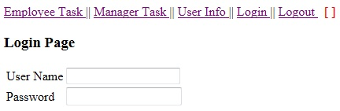
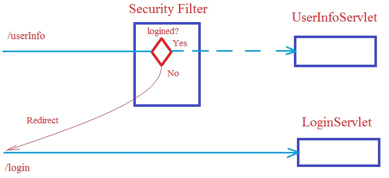
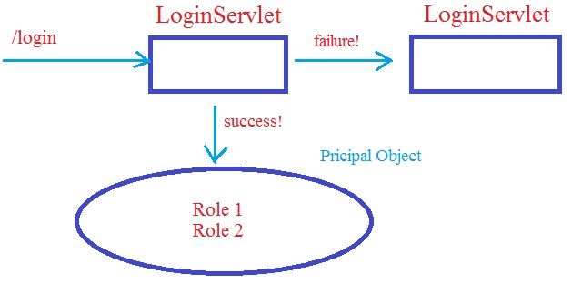
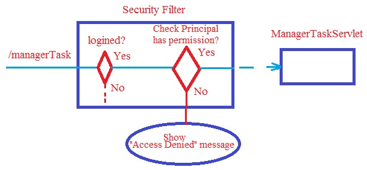
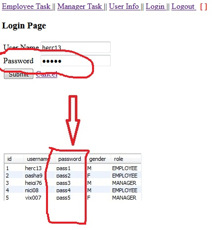
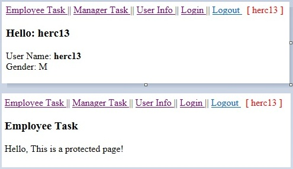
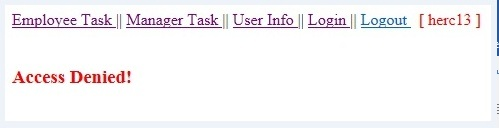
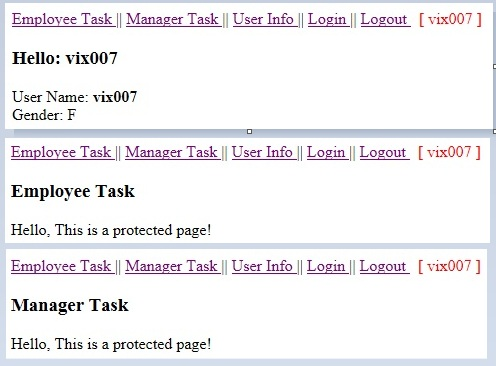

# SecurityWebApp
Login application using Maven, JSP, Servlet, JDBC and SQL. The pages are secured with Java Servlet Filter.

The SecurityWebApp is an MVC app that uses the so called "JavaBeans" and "DAOs" - standing for Data Access Objects - 
to handle the interactions with the MySQL database. The app has a connection pool.

This web app allows the user to access every common page without asking for a password. Also, if a user visits a protected page, 
it will redirect to the login page.

In security, there are 2 important concepts such as Principal and  Role. 

Principal can be temporarily understood as a "Subject" after logging into a system. It is entitled to do something in the system. 
An "Subject" can have one or more roles. This depends on the permissions of application for each different user account. 

Role is a set of permissions for an application. This web application has 2 roles of " EMPLOYEE"  and " MANAGER". 

1.	The EMPLOYEE role allows accessing the 2 pages such /userInfo and /employeeTask
2.	The MANAGER role allows accessing the 2 pages such as /userInfo and /managerTask.

In the Java web app, a  Servlet Filter is specially used to handle security. It is usually called Security Filter. 

When the user accesses a protected page, the Security Filter will test it. If the user is not logged in, the user's request 
will be redirected to the login page.

If the user has accessed successfully, a Principal object is created. It brings the user's information, including roles. 

If the user has successfully logged in before, and accessed to a protected page. The Security Filter will check if the user's 
roles are appropriate to access this page or not. If it is invalid, it will show the user a page informing Access denied. 

The users password is stored in the database and when an user attempts to login it will compare the password with 
information from the database:

Every user has a role: employee or manager. herc13 has employee role and he can access only User Info and Employee Task pages. 

This user cannot access Manager Task page. The application will display an Access Denied information because the user has 
unappropriate role.

vix007 has manager role and he can access all the 3 pages: User Info, Employee Task and Manager Task. 

